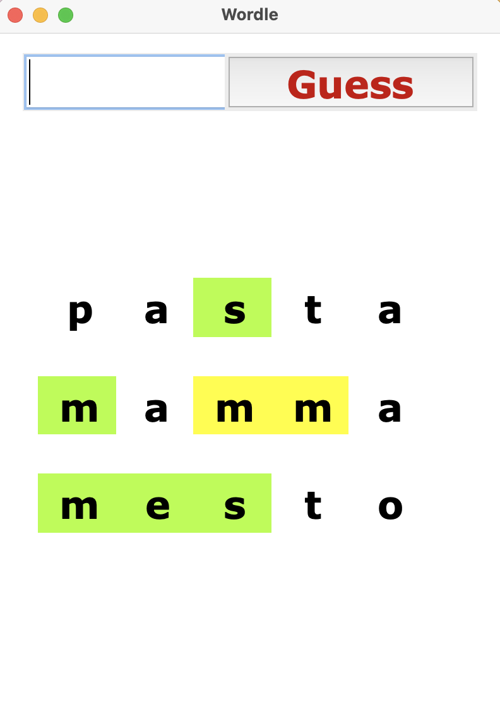

# PyWordle
 
 This repository contains a simple tkinter implementation of the well-known [NYT wordle](https://www.nytimes.com/games/wordle/index.html) in Python.
 To run the game just download this repository, make sure you have tkinter and numpy in your python packages, and run:
 
 `python play.py`
 
An example of interface follows:

*Note*: beta version now supports only italian vocabulary, new languages coming soon
